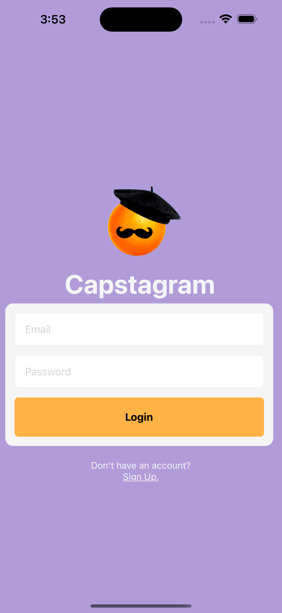
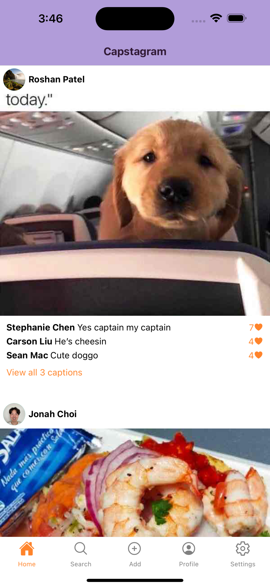
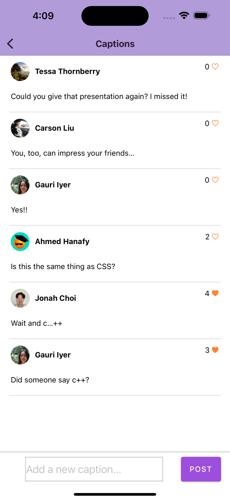
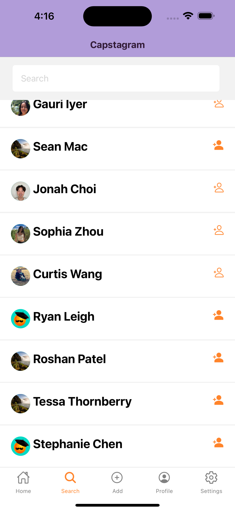
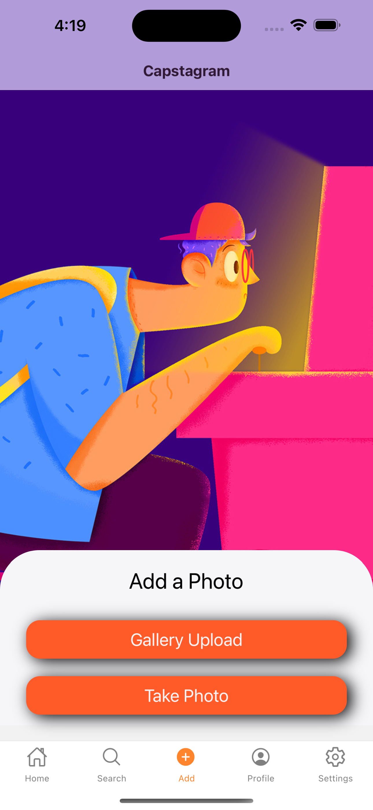
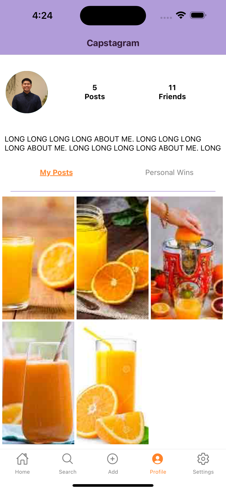
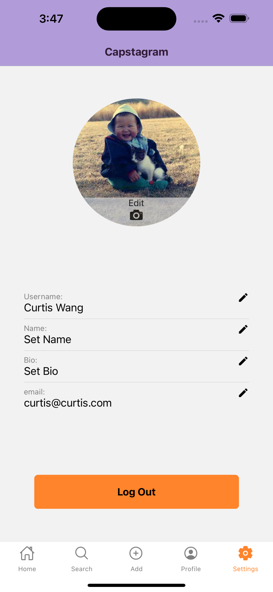

<a name="readme-top"></a>

<!-- PROJECT LOGO -->
<br />
<div align="center">
  <a href="https://github.com/SpiritedAway-BO/Capstagram">
    
  </a>

<h3 align="center">Capstagram</h3>

  <p align="center">
    We are a team of 6 software engineers who were tasked with creating a full-stack photo and caption sharing mobile application. As a team we decided to use React-Native and Expo to build out the front-end, and Express and Node with a Neo4j database for our back-end. This project was a challenging but rewarding experience for all of us as web developers to gain a taste of mobile development.
    <br />
    <br />
    <a href="https://github.com/SpiritedAway-BO/Capstagram/issues">Report Bug</a>
    ·
    <a href="https://github.com/SpiritedAway-BO/Capstagram/issues">Request Feature</a>
  </p>
</div>


<!-- TABLE OF CONTENTS -->
<details>
  <summary>Table of Contents</summary>
  <ol>
    <li>
      <a href="#about-the-project">About The Project</a>
      <ul>
        <li><a href="#built-with">Built With</a></li>
      </ul>
    </li>
    <li>
      <a href="#getting-started">Getting Started</a>
      <ul>
        <li><a href="#prerequisites">Prerequisites</a></li>
        <li><a href="#installation">Installation</a></li>
      </ul>
    </li>
    <li><a href="#meet-the-team">Meet the Team</a></li>
  </ol>
</details>


<!-- ABOUT THE PROJECT -->
## About The Project

<p align="center">

</p>

Capstagram allows users to sign up and post photos for other users to leave captions on. The captions can be liked and unliked by your friends, with the most liked captions obtaining the coveted few spots on the home feed. A user's home feed shows them all photos their friends have posted, along with the top voted captions on each photo.

<p align="center">

</p>

Friends photos displayed in the main feed are shown most recent first. When a user presses view all # captions under a photo they are redirected to the captions galore page where all the captions for that photo are displayed. Captions on this page are displayed most recent first, and there is also an input box stickied to the bottom that allows users to add a new caption to a photo.

<p align="center">

</p>

Users can add new friends by pressing Search on the bottom nav bar to pull up a list of all Capstagram users allowing them add friends by filtering using the input box stickied to the top or by scrolling through the list to find the user you want to add.

<p align="center">

</p>

Users can add a photo by pressing the add photo button in the middle of the bottom nav bar. They can then select to upload a photo from their device or take a picture with the device's built in camera. Once a photo is successfully uploaded, the user is directed to the profile page.

<p align="center">

</p>

To navigate to a users profile page, users can press the profile button on the bottom nav bar to see their profile screen. On the profile screen users can see their display picture as well as how many posts they have and how many friends they have. Friends is pressable to display a list of the users friends. Users can also toggle between their own posts and their personal wins page with a simple press of a button.

<p align="center">

</p>

The account page can be accessed by pressing the settings button on the bottom nav bar. Users will be navigated to their account page where they can change their profile picture, and edit various account details like their name and bio. There is also a button to logout if the user is done using the app.

<p align="center">

</p>

<p align="right">(<a href="#readme-top">back to top</a>)</p>


### Built With

* [![React][React.js]][React-url]
* [![Expo][Expo.js]][Expo-url]
* [![Express][Express.js]][Express-url]
* [![Node][Node.js]][Node-url]
* [![Neo4j][Neo4j.js]][Neo4j-url]

<p align="right">(<a href="#readme-top">back to top</a>)</p>


<!-- GETTING STARTED -->
## Getting Started

To get a local copy up of Capstagram up and running follow these steps below.

### Prerequisites

* npm
  ```sh
  npm install npm@latest -g
  ```
* Firebase Account
* Neo4j Aura DB Account
* A physical mobile device or a mobile simulator

### Installation

1. Clone the repo
   ```git
   git clone https://github.com/SpiritedAway-BO/Capstagram.git
   ```
2. Navigate into both the client and server directories and install npm packages
   ```git
   cd client/
   npm install
   -----------
   cd server/
   npm install
   ```
3. Navigate to client/components/Auth/firebase and copy the example_config in the same directory and call it `config.js`. Replace with your Firebase and Local Tunnel information.
   ```env
   REACT_APP_FIREBASE_KEY: 'INSERT KEY HERE',
   REACT_APP_FIREBASE_DOMAIN: 'INSERT DOMAIN HERE',
   REACT_APP_FIREBASE_PROJECT_ID: 'INSERT PROJECT ID HERE',
   REACT_APP_FIREBASE_STORAGE_BUCKET: 'INSERT STORAGE BUCKET HERE',
   REACT_APP_FIREBASE_SENDER_ID: 'INSERT SENDER ID HERE',
   REACT_APP_FIREBASE_APP_ID: 'INSERT APP ID HERE',
   LOCALTUNNEL: 'INSERT LOCAL TUNNEL URL HERE',
   ```
4. Navigate to server directory and copy the example.env in the same directory and call it `.env`. Replace with your Neo4j Aura DB information.
   ```env
   NEO4J_URI=YOUR NEO4J AURA URI
   NEO4J_USERNAME=YOUR NEO4J USERNAME
   NEO4J_PASSWORD=YOUR NEO4J PASSWORD
   AURA_INSTANCENAME=YOUR NEO4J AURA INSTANCE NAME
   ```
5. In new terminal window, navigate into server directory and run
   ```sh
   npm run server
   ```
6. In new terminal window, navigate into client directory and run
   ```sh
   npm run start
   ```

<p align="right">(<a href="#readme-top">back to top</a>)</p>


<!-- CONTACT -->
## Meet the team:

<p>
  <b>Stephanie Chen</b> <br>
  &nbsp;&nbsp;&nbsp;&nbsp;&nbsp; LinkedIn: <a href="https://www.linkedin.com/in/stephaniezjchen/">@stephaniezjchen</a> <br>
  &nbsp;&nbsp;&nbsp;&nbsp;&nbsp; GitHub: <a href="https://github.com/stephaaniechen">@stephaaniechen</a> <br>
  <b>Ahmed Hanafy</b> <br>
  &nbsp;&nbsp;&nbsp;&nbsp;&nbsp; LinkedIn: <a href="https://www.linkedin.com/in/ahmed-hanafy9/">@ahmed-hanafy9</a> <br>
  &nbsp;&nbsp;&nbsp;&nbsp;&nbsp; GitHub: <a href="https://github.com/AhmedHanafy9">@AhmedHanafy9</a> <br>
  <b>Ryan Leigh</b> <br>
  &nbsp;&nbsp;&nbsp;&nbsp;&nbsp; LinkedIn: <a href="https://www.linkedin.com/in/leigh-ryan/">@leigh-ryan</a> <br>
  &nbsp;&nbsp;&nbsp;&nbsp;&nbsp; GitHub: <a href="https://github.com/ryan-leigh">@ryan-leigh</a> <br>
  <b>Roshan Patel</b> <br>
  &nbsp;&nbsp;&nbsp;&nbsp;&nbsp; GitHub: <a href="https://github.com/roshanupatel">@roshanupatel</a> <br>
  <b>Tessa Thornberry</b> <br>
  &nbsp;&nbsp;&nbsp;&nbsp;&nbsp; LinkedIn: <a href="https://www.linkedin.com/in/tessathornberry/">@tessathornberry</a> <br>
  &nbsp;&nbsp;&nbsp;&nbsp;&nbsp; GitHub: <a href="https://github.com/tessathornberry">@tessathornberry</a> <br>
  <b>Curtis Wang</b> <br>
  &nbsp;&nbsp;&nbsp;&nbsp;&nbsp; LinkedIn: <a href="https://www.linkedin.com/in/curtiswang1014/">@curtiswang1014</a> <br>
  &nbsp;&nbsp;&nbsp;&nbsp;&nbsp; GitHub: <a href="https://github.com/cwang1014">@cwang1014</a> <br>
</p>

Capstagram Link: [https://github.com/SpiritedAway-BO/Capstagram](https://github.com/SpiritedAway-BO/Capstagram)

<p align="right">(<a href="#readme-top">back to top</a>)</p>


<!-- MARKDOWN LINKS & IMAGES -->
<!-- https://www.markdownguide.org/basic-syntax/#reference-style-links -->
[React.js]: https://img.shields.io/badge/React&ndash;Native-20232A?style=for-the-badge&logo=react&logoColor=61DAFB
[React-url]: https://reactjs.org/
[Expo.js]: https://img.shields.io/badge/Expo-000020?style=for-the-badge&logo=expo&logoColor=white
[Expo-url]: https://expo.dev/
[Express.js]: https://img.shields.io/badge/Express-000000?style=for-the-badge&logo=express&logoColor=white
[Express-url]: https://expressjs.com/
[Node.js]: https://img.shields.io/badge/Node.js-339933?style=for-the-badge&logo=nodedotjs&logoColor=white
[Node-url]: https://nodejs.org/en/
[Neo4j.js]: https://img.shields.io/badge/Neo4j-4581C3?style=for-the-badge&logo=neo4j&logoColor=white
[Neo4j-url]: https://neo4j.com/